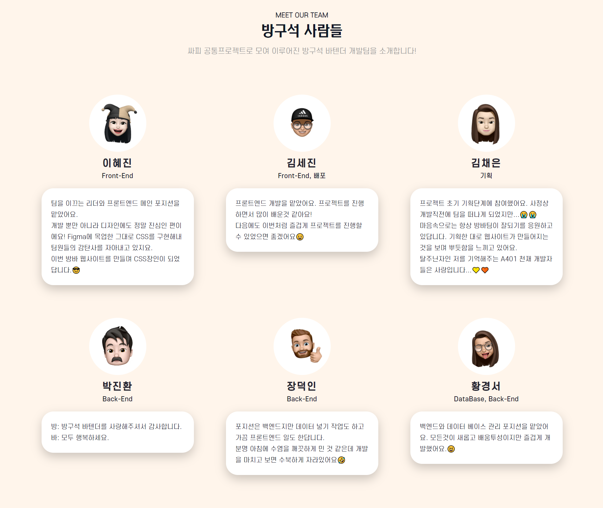
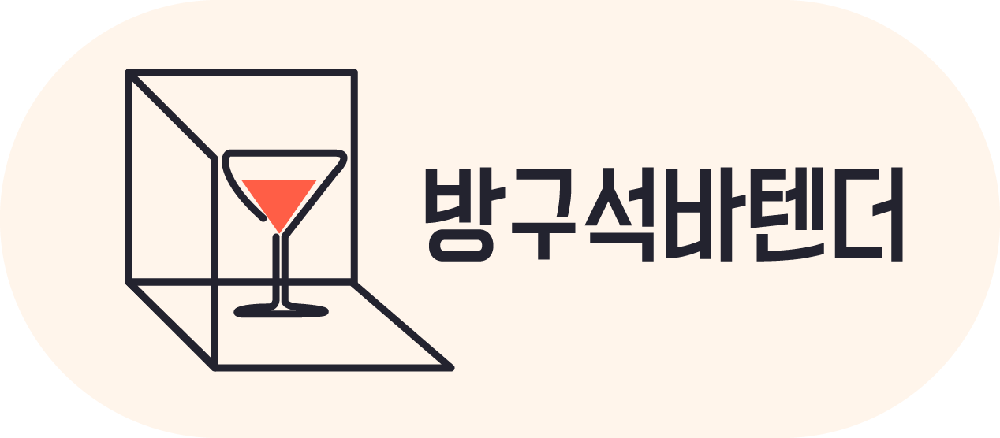
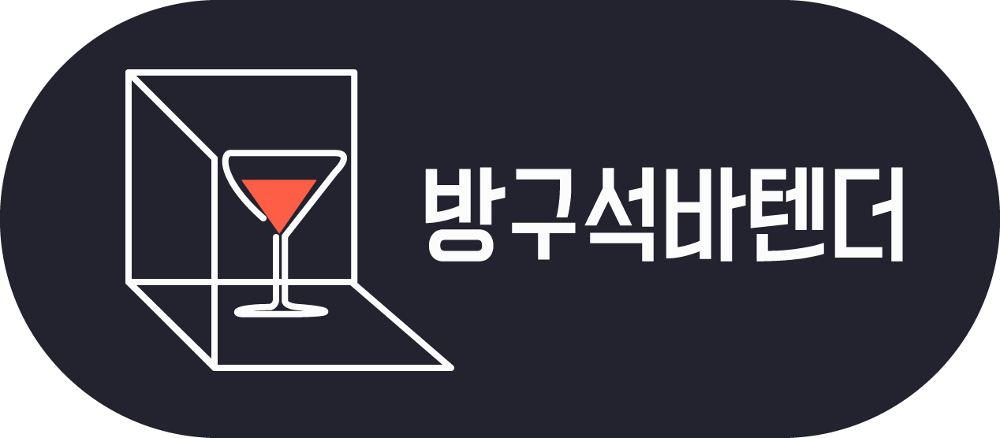
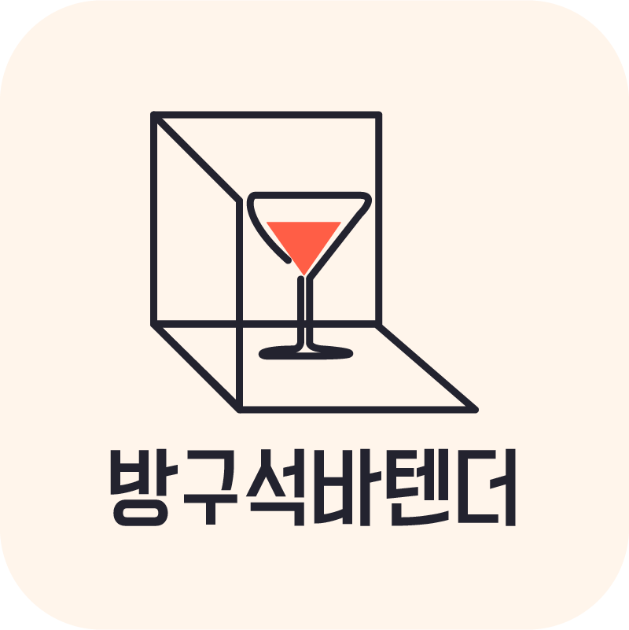
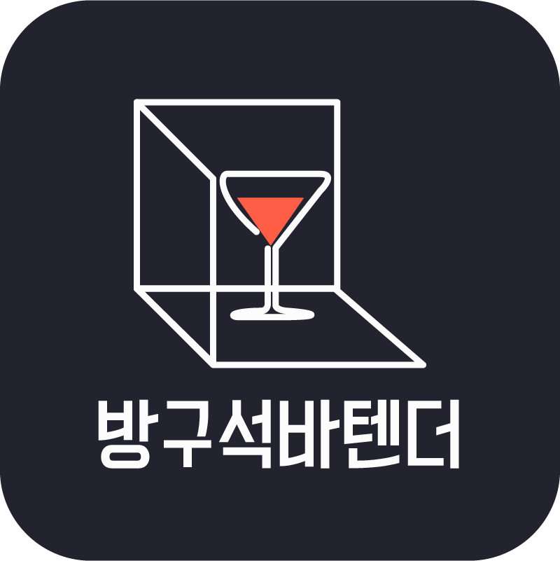
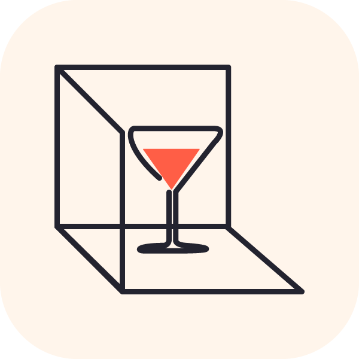
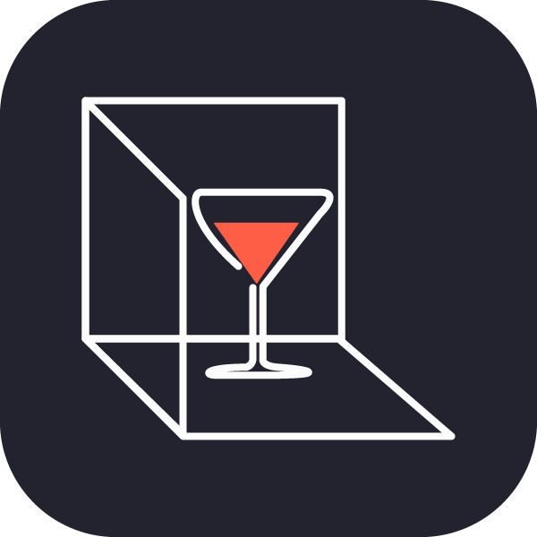

# 방구석 바텐더
`공통 프로젝트` `웹기술` `SUB3`

방구석 바텐더는 코로나 시대의 연장으로 홈술, 혼술을 즐기는 사람들이 고급 술로만 인식되었던 칵테일을 집에서도 쉽게 즐길 수 있도록 하기 위해 칵테일 추천 및 레시피 정보를 제공하는 웹사이트입니다.

### 👀 이런 분들을 위해 만들었어요

- 칵테일은 처음인 입문자
- 칵테일에 대해 알고 있지만 일부 유명한 레시피만 알고있는 중수
- 기존 공식 레시피를 벗어나 나만의 칵테일 레시피를 공유하고 싶은 고수

### 📣 방구석 바텐더에서 제공하는 경험

- 칵테일에 대해 잘 몰라도 `칵테일 추천` 탭에서 나에게 맞는 칵테일 레시피를 추천받을 수 있어요
- 공식 칵테일 및 사용자들의 커스텀 레시피를 조회 및 검색할 수 있어요
- 나만의 칵테일 레시피가 있다면 작성하여 다른 사용자들에게 널리 알릴 수 있어요
- 마음에 드는 칵테일 레시피에 `좋아요` 버튼을 누르거나 북마크를 하여 모아보기 할 수 있어요
- 마음에 드는 사용자가 있다면 팔로우 및 해당 사용자의 게시물을 모아볼 수 있어요
- 게시판에서 공지사항 등을 확인할 수 있으며 질문 혹은 후기를 남길 수 있어요

### 🚀 기술 스택

##### Programming Languages
   

##### Framework
  

##### Design
 

##### Hosting/SaaS


##### Servers


##### Databases


### 프로젝트 실행하기

#### Frontend

```shell
cd frontend/bang-bar
npm install
npm run serve
```

#### Backend

```shell
cd backend
./mvnw clean package
cd target
java -jar (생성된 jar 파일)
```

## 개발 일정

|1주차|2주차|3주차|4주차|5주차|6주차|
|--|--|--|--|--|--|
|- 아이디어 기획 <br />- 요구사항 명세서 작성|- 화면 설계<br />- 디자인 목업<br />- 기능 명세서 작성, DB설계|- AWS에 DB 연동 <br />- 웹사이트 뼈대 구축 <br />- 로그인 및 레시피 등 기본기능 구현|- 핵심기능 개발 <br />- 프론트엔드 (Vue.js)와 백엔드 (Java Spring) 연동 <br />- 테스트 시나리오 및 웹사이트 중간 배포|- 필수기능 개발 (추천, 마이페이지 등)|- 버그 픽스 <br />- 테스트 데이터 삽입 <br />- 최종 배포|

<br />
<br />

---

### 프로젝트730 팀원 소개



### 웹사이트 로고 (light/dark ver.)

<div style="display: flex; margin-bottom: 30px">



</div>

<div style="display: flex; margin-bottom: 30px">



</div>

<div style="display: flex; margin-bottom: 30px">



</div>